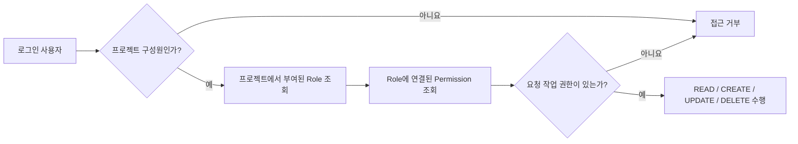

# WEPLE

> 프로젝트와 업무를 한곳에서 관리하는 웹 기반 협업 플랫폼

<p align="center">
  
  
  
  
  
  
</p>

---

## 프로젝트 소개

WEPLE은 기업과 개발 조직에서 프로젝트, 일감, 마일스톤, 일정 및 협업 이력을 통합 관리할 수 있도록 개발한 협업 플랫폼입니다.

프로젝트별 업무 현황을 대시보드에서 확인하고, 마일스톤과 간트 차트를 이용해 개발 일정을 관리할 수 있습니다. 역할별 권한 관리와 GitHub 저장소, 위키, 파일, 알림 기능도 함께 제공합니다.

- 개발 기간: 2026.06 ~ 2026.07
- 개발 인원: 5명
- 개발 형태: 팀 프로젝트
- 원본 저장소: [KDTFinalProject/KdtFinalProject](https://github.com/KDTFinalProject/KdtFinalProject)
- 개인 GitHub: [github.com/smk412](https://github.com/smk412)

> 이 저장소는 팀 프로젝트를 개인 포트폴리오 목적으로 포크한 저장소입니다.  
> 프로젝트 전체 기능과 함께 제가 담당한 개발 영역과 문제 해결 경험을 중심으로 정리했습니다.

---

## 주요 기능

### 프로젝트 및 업무 관리

- 프로젝트 생성과 구성원 관리
- 일감 등록·수정·삭제 및 담당자 지정
- 일감 상태·우선순위·유형 관리
- 프로젝트 칸반 보드 제공

### 마일스톤 및 로드맵

- 상위 버전과 하위 마일스톤 관리
- 마일스톤별 일감 연결
- 완료 일감과 평균 진척도 계산
- 목표 완료일 기준 지연 일수 표시
- 프로젝트 단위 로드맵 제공

### 일정 및 현황 시각화

- 간트 차트를 통한 일정 확인
- 프로젝트 전체 진행률 제공
- 대시보드에서 참여 프로젝트 조회
- 최근 활동과 마감 일감 추적

### 협업 및 관리

- GitHub 저장소와 커밋 정보 조회
- 프로젝트 위키와 파일 관리
- 사용자 알림 및 활동 이력
- 사용자·그룹·역할·권한 관리

---

# 담당 역할

## 송민규 — Backend / Full Stack

프로젝트에서 Git 협업 관리와 함께 다음 기능을 담당했습니다.

| 담당 영역 | 주요 내용 |
|---|---|
| 마일스톤 | 상위 버전 및 하위 마일스톤 CRUD |
| 로드맵 | 마일스톤 계층, 일감 통계, 진척도 및 지연일 조회 |
| DB 조회 개선 | 복합 인덱스 적용 및 로드맵 조회 구조 단순화 |
| 권한 처리 | 프로젝트 멤버십·Role·Permission 기반 접근 제어 |
| 간트 차트 | 프로젝트 일정과 일감 계층 데이터 구성 |
| 프로젝트 개요 | 진행률, 구성원 및 일감 현황 조회 |
| 대시보드 | 참여 프로젝트, 최근 활동, 마감 일감 조회 |
| 일감 유형 | 일감 유형 등록·조회·수정 및 관리 화면 |
| 통합 테스트 | 삭제 일감, 권한 검증 및 화면 결함 수정 |

### 개발 흐름

```text
일감 유형 관리
    ↓
마일스톤 CRUD
    ↓
상위 버전과 하위 마일스톤 계층 구성
    ↓
마일스톤 상세 및 일감 연결
    ↓
로드맵 조회 성능 개선
    ↓
프로젝트 권한 적용
    ↓
간트 차트·프로젝트 개요·대시보드 연동
    ↓
통합 테스트 및 결함 수정
```

---

# 주요 개발 내용

## 1. 마일스톤 및 로드맵

프로젝트 일정을 상위 버전과 하위 마일스톤으로 나누어 관리할 수 있도록 마일스톤 기능을 구현했습니다.

```text
상위 버전
├─ 하위 마일스톤
│  ├─ 연결 일감
│  ├─ 전체·완료 일감 수
│  ├─ 평균 진척도
│  └─ 지연 일수
└─ 하위 마일스톤 통계 합산
```

주요 구현 내용은 다음과 같습니다.

- 상위 버전 등록·조회·수정·삭제
- 하위 마일스톤 등록 및 상위 버전 연결
- 마일스톤에 일감 연결·해제
- 일감 평균 진척도 계산
- 완료된 하위 마일스톤 수 계산
- 목표 완료일이 지난 마일스톤의 지연 일수 계산
- 마일스톤 상세 화면 페이징 및 통계 제공

---

## 2. 로드맵 DB 조회 최적화

### 문제

기존 로드맵 조회는 하나의 SQL에서 부모·자식 마일스톤 조회와 일감 통계를 모두 처리했습니다.

이 과정에서 다음 문제가 발생했습니다.

- 마일스톤 및 일감 테이블 Full Table Scan 가능성
- 부모·자식 마일스톤 Self Join
- 일감 통계와 부모 통계의 중첩 집계
- 자식 수만큼 부모 데이터가 중복 반환
- 데이터 증가에 따라 조회 지연 발생

### 개선

조회 조건에 맞춰 다음 복합 인덱스를 적용했습니다.

```sql
CREATE INDEX IDX_MILESTONE_ROADMAP
ON MILESTONE (
    PROJECT_ID,
    PARENT_MILESTONE_ID
);
```

이후 하나의 복잡한 SQL을 두 개의 평면 조회로 분리했습니다.

```text
1. 특정 프로젝트의 마일스톤 목록 조회
2. 해당 프로젝트의 마일스톤별 일감 통계 조회
3. Java에서 milestoneId 기준으로 통계 연결
4. parentMilestoneId 기준으로 부모·자식 구조 구성
```

Java에서는 마일스톤과 통계를 Map으로 변환하여 반복 탐색 없이 연결했습니다.

```java
Map<Long, TaskStatDTO> statMap = taskStats.stream()
        .collect(Collectors.toMap(
                TaskStatDTO::getMilestoneId,
                stat -> stat
        ));

Map<Long, MilestoneInfoVO> milestoneMap = infoList.stream()
        .collect(Collectors.toMap(
                MilestoneInfoVO::getMilestoneId,
                milestone -> milestone
        ));
```

### 개선 결과

| 개선 전 | 개선 후 |
|---|---|
| Full Table Scan 가능성 | 복합 인덱스 활용 |
| 부모·자식 Self Join | Java에서 계층 구조 구성 |
| 중첩 집계 | 일감 통계 1회 집계 |
| 하나의 복잡한 SQL | 단순한 SQL 2개로 분리 |
| 광범위한 데이터 탐색 | 프로젝트 단위 범위 조회 |
| 부모 데이터 중복 반환 | 마일스톤당 한 행 반환 |

Chrome 개발자 도구의 Network 탭을 이용해 로드맵 화면 응답 시간을 비교했을 때, 개발 환경 기준으로 약 **3초에서 0.9초 수준**으로 감소했습니다.

> 해당 수치는 별도의 부하 테스트 도구로 측정한 공식 벤치마크가 아니라, 동일한 개발 환경에서 기능 개선 전후를 확인한 체감 측정 결과입니다.

---

## 3. 프로젝트 Role·Permission 권한 처리

### 문제

로그인 여부만 확인하면 사용자가 URL을 직접 입력하거나 요청을 변조해 참여하지 않은 프로젝트 또는 권한이 없는 기능에 접근할 수 있었습니다.

또한 프로젝트마다 사용자가 맡는 역할이 다르기 때문에 사용자 계정에 고정된 권한만으로는 프로젝트별 접근 권한을 표현하기 어려웠습니다.

### 권한 모델

사용자에게 권한을 직접 부여하지 않고, 프로젝트 구성원에게 Role을 부여하고 Role에 Permission을 연결하는 구조를 적용했습니다.

```text
User
  ↓
Project Member
  ↓
Member Role
  ↓
Role
  ↓
Role Permission
  ↓
Permission
```

테이블 관계는 다음과 같습니다.

```text
USERS
  │
  └─ MEMBERS
       │
       └─ MEMBER_ROLES
            │
            └─ ROLES
                 │
                 └─ ROLE_PERMISSIONS
                      │
                      └─ PERMISSIONS
```

### 요청 검증 흐름



실제 요청은 다음 순서로 검증했습니다.

```text
사용자 인증
    ↓
프로젝트 구성원 확인
    ↓
프로젝트에서 부여된 Role 확인
    ↓
Role에 연결된 Permission 코드 조회
    ↓
요청 작업에 필요한 권한 검증
    ↓
허용 또는 접근 거부
```

### 1단계: 프로젝트 구성원 확인

```sql
SELECT COUNT(*)
FROM members
WHERE project_id = #{projectId}
  AND user_code = #{userCode}
```

프로젝트 구성원이 아니면 Role과 Permission을 조회하기 전에 접근을 차단했습니다.

```java
if (!hasProjectAccess(loginUser, projectId)) {
    return "weple/access-denide";
}
```

### 2단계: Role을 통한 Permission 조회

```sql
SELECT DISTINCT rp.permission_code
FROM members m
JOIN member_roles mr
  ON m.member_id = mr.member_id
JOIN role_permissions rp
  ON mr.role_id = rp.role_id
WHERE m.user_code = #{userCode}
  AND m.project_id = #{projectId}
```

사용자와 프로젝트를 조건으로 구성원에게 부여된 Role을 찾고, 해당 Role이 가진 Permission 코드 목록을 조회했습니다.

### 3단계: 요청 작업별 권한 검증

```java
Set<String> permissionCodes =
        findMilestonePermissionCodes(loginUser, projectId);

if (!hasMilestonePermission(
        permissionCodes,
        PERMISSION_MILESTONE_CREATE_UPDATE_DELETE
)) {
    return "weple/access-denide";
}
```

권한 코드는 기능과 행위에 따라 구분했습니다.

```java
private static final String PERMISSION_MILESTONE_CREATE_UPDATE_DELETE
        = "k1_version";

private static final String PERMISSION_TASK_CREATE
        = "k3_add";

private static final String PERMISSION_TASK_UPDATE
        = "k3_edit";

private static final String PERMISSION_TASK_MYUPDATE
        = "k3_myedit";
```

### 화면과 서버의 이중 검증

조회한 권한은 화면 버튼 노출에도 사용했습니다.

```java
model.addAttribute(
        "canAddTask",
        hasMilestonePermission(
                permissionCodes,
                PERMISSION_TASK_CREATE
        )
);
```

하지만 버튼을 숨기는 것만으로는 요청 조작을 막을 수 없으므로, 실제 등록·수정·삭제 요청을 처리하는 Controller에서도 같은 Permission을 다시 검사했습니다.

```text
화면 권한 검증
└─ 권한이 없는 버튼과 메뉴를 숨김

서버 권한 검증
└─ URL 직접 접근 및 변조된 요청을 차단
```

### 권한 처리 결과

- 프로젝트 비구성원의 URL 직접 접근 차단
- 프로젝트별로 서로 다른 Role 부여 가능
- Role에 따라 기능별 Permission 구성 가능
- 조회·등록·수정·삭제 요청을 Controller에서 검증
- 권한이 없는 버튼을 화면에서 비활성화
- 화면 조작과 관계없이 서버에서 최종 접근 차단

---

## 4. 삭제 일감과 통계 정합성 개선

일감을 논리 삭제해도 기존 통계에는 삭제된 일감이 포함되는 문제가 있었습니다.

그 결과 화면에서는 보이지 않는 일감이 다음 값에 계속 반영될 수 있었습니다.

- 전체 일감 수
- 완료 일감 수
- 평균 진척도
- 간트 차트
- 프로젝트 개요와 대시보드 통계

관련 조회 조건에 논리 삭제 여부를 적용했습니다.

```sql
AND deleted_yn = 'N'
```

이를 통해 화면에 노출되는 데이터와 통계에 반영되는 데이터의 범위를 일치시켰습니다.

---

## 5. 간트 차트 및 프로젝트 개요

프로젝트의 마일스톤과 일감을 일정 관점에서 확인할 수 있도록 조회 결과를 간트 차트용 계층 데이터로 변환했습니다.

주요 구현 내용은 다음과 같습니다.

- 프로젝트별 일감 조회
- 상위·하위 일감 관계 구성
- 시작일과 종료일을 이용한 간트 차트 데이터 생성
- 삭제된 일감 제외
- 프로젝트 구성원 및 그룹별 현황 조회
- 프로젝트 전체 진행률 계산
- DTO를 이용한 조회 결과와 화면 모델 분리
- 프로젝트 구성원 및 Permission 기반 접근 제한

---

## 6. 대시보드

로그인한 사용자가 참여 중인 프로젝트와 주요 업무 현황을 한 화면에서 확인할 수 있도록 대시보드를 구현했습니다.

- 참여 프로젝트 조회
- 프로젝트별 일감 현황
- 최근 활동 내역
- 마감 예정 및 지연 일감
- 프로젝트 진행 상태
- 사용자 프로필 정보

전체 데이터를 가져와 애플리케이션에서 필터링하지 않고 사용자와 프로젝트 조건을 SQL에 적용해 필요한 범위만 조회했습니다.

---

## 기술 스택

### Backend

- Java 21
- Spring Boot 3.5
- Spring MVC
- Spring Security
- MyBatis
- Spring Data JPA
- Maven
- Lombok

### Frontend

- Thymeleaf
- HTML5
- CSS3
- JavaScript
- Bootstrap

### Database

- Oracle Database
- Oracle JDBC
- MyBatis XML Mapper

### Infrastructure and Collaboration

- Docker
- AWS S3
- GitHub
- Jenkins
- Git Flow 기반 브랜치 협업

---

## 프로젝트 구조

```text
src/main/java/com/weple/cloud
├─ Configuration
├─ auth
├─ dashboard
├─ gantt
├─ milestone
│  ├─ mapper
│  ├─ service
│  │  └─ impl
│  └─ web
├─ outline
├─ project
├─ repository
├─ system
├─ task
└─ wiki

src/main/resources
├─ mapper
├─ static
├─ templates
└─ application.properties
```

기능별로 Controller, Service, Mapper 계층을 분리하고 MyBatis XML Mapper에서 SQL을 관리했습니다.

---

## 실행 환경

| 구분 | 버전 및 구성 |
|---|---|
| JDK | 21 |
| Spring Boot | 3.5.16 |
| Maven | 3.9.x |
| Database | Oracle |
| WAS | Embedded Tomcat |
| 로컬 포트 | 8073 |
| 운영 포트 | 80 |

### 로컬 실행

Oracle DB와 필수 환경변수를 준비한 후 실행합니다.

```bash
mvn spring-boot:run
```

또는 JAR로 패키징해 실행할 수 있습니다.

```bash
mvn clean package
java -jar target/weple-0.0.1-SNAPSHOT.jar
```

> 데이터베이스와 외부 서비스 인증정보는 보안상 저장소에 공개하지 않습니다.

---

## 팀 구성

| 이름 | 역할 |
|---|---|
| 방진영 | 팀장 / 프로젝트 총괄 |
| 김병완 | 부팀장 / 배포 |
| 김은지 | DB |
| 김민지 | 개발환경 |
| **송민규** | **Git 협업 관리 / 마일스톤·로드맵·간트 차트·대시보드 개발** |

팀원 전체의 협업으로 완성한 프로젝트이며, 이 README는 그중 송민규의 담당 기능과 문제 해결 경험을 중심으로 정리했습니다.

---

## 회고

WEPLE을 개발하면서 기능 구현뿐 아니라 데이터 증가, 권한 범위, 통계 정합성까지 함께 고려해야 한다는 점을 배웠습니다.

로드맵 조회에서는 복잡한 SQL 하나로 모든 결과를 만들던 구조를 인덱스 기반의 단순 조회와 Java 계층 조립 방식으로 변경했습니다. 이 과정에서 쿼리의 복잡도를 줄이는 것과 DB·애플리케이션 사이의 책임을 적절하게 분배하는 것이 중요하다는 점을 경험했습니다.

권한 처리에서는 단순 로그인 확인을 넘어 프로젝트 구성원, Role, Permission으로 이어지는 접근 제어 흐름을 설계했습니다. 화면에서 버튼을 숨기는 것만으로 끝내지 않고 Controller에서 실제 요청 권한을 다시 검사해 URL 직접 접근과 변조 요청을 차단했습니다.

이 경험을 통해 다음 역량을 키울 수 있었습니다.

- 조회 패턴을 고려한 복합 인덱스 설계
- 복잡한 SQL의 책임 분리
- Map 기반 계층 데이터 구성
- Role·Permission 기반 접근 제어
- 논리 삭제 데이터와 통계 정합성 관리
- 통합 테스트를 통한 기능 간 결함 발견 및 수정
